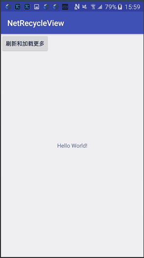

# NetListLayout

> 通用listview/recycleview的封装思路示范

# 思路

## 共同点

* 页面状态: 对于一个app而言,第一次进入页面时,页面状态应该是有确定的种类和UI的,比如加载中页面,加载失败页面,内容为空的页面,以及正常的内容页面.

* 刷新+加载更多: 分批加载,基本上都有下拉刷新和上拉加载更多的逻辑
* 底层网络请求一般都是http
* 图片加载一般都要求尽量节省内存,并且不卡顿,为达到此目的,基本的解析逻辑/参数是类似的

## 不同点

各种页面状态的UI,刷新头UI,加载更多的UI会根据项目的不同而不同,不同页面间可能不同

各页面的listview或recycleview的具体布局不同,分隔线可能不同

各页面的网络url和请求参数不同,

每条item布局以及对应的javabean不同,对应的viewholder或adapter不同

> 综上,逻辑方面都是一致的,UI方面大体一致,部分页面间有差异,
>
> 一定不同的有:
>
> item布局,
>
> javabean,
>
> url和请求参数
>
> viewholder或adapter

# 最终效果

 

gif演示

